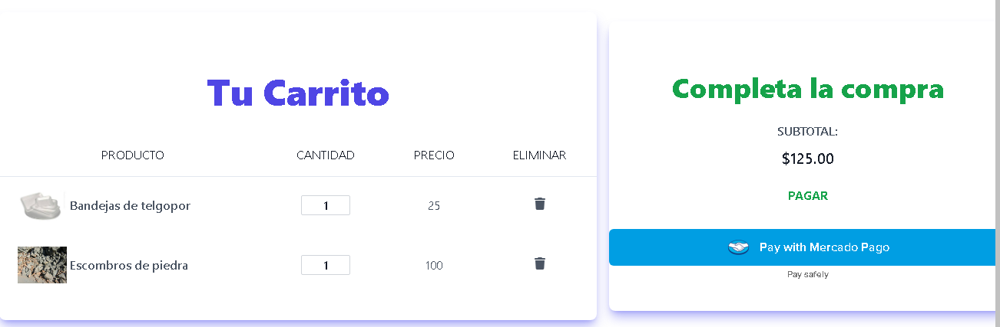

# Mercado de residuos

> Un servicio intermediario confiable para la compra y venta de residuos.

Landing page creada por los estudiantes de Henry que han participado en el proyecto.

## Construido con

- React Vite
- ApolloClient
- ApolloServer
- Graphql
- NodeJS
- Express

## Demo en vivo

[Demo](https://https://market-residuos.vercel.app)

# Características

## Mercado Pago

Se utilizo la SDK que incluye Mercado pago tanto para React como para Express.

## Inicio de sesión con Google

Se utilizo la API que provee google para la verificacion en conjunto con las credenciales que se otorgan a através de console.cloud.google

## Verificion de correo electrónico

Se utilizo la libreria nodemailer para enviar notificaciones a correos de usuario para conocer identificar su identidad.

# Market de MDR

Aqui es donde se juntan los productos que tiene disponible la plataforma de sus ditintos usuarios.

# Dashboard de usuario

En el dashboard de Usuario es donde disponemos de todas las funcionalidades como usuario de la plataforma.

# Blog

Este es el blog por el cual MDR tiene posibilidad de informar a su comunidad.

# Participantes del proyecto

**Juan Mansilla**

- GitHub: [@MarcosRehtanz](https://github.com/MarcosRehtanz)
- LinkedIn: [LinkedIn](https://www.linkedin.com/in/juan-marcos-mansilla/)

**Gina Medina**

- GitHub: [@Gmedina12](https://github.com/Gmedina12)
- LinkedIn: [LinkedIn](https://www.linkedin.com/in/ginapaolamedina/)

**Melani Depetris**

- GitHub: [@Melani-Depetris](https://github.com/Melani-Depetris/)
- LinkedIn: [LinkedIn](https://www.linkedin.com/in/melani-depetris/)

**Jonnier Salaverria**

- GitHub: [@JonnierAS](https://github.com/JonnierAS)
- LinkedIn: [LinkedIn](https://www.linkedin.com/in/jonnier-salaverria-65ab66173/)

**José Miguel Figueroa**

- GitHub: [@Josemfigueroa04](https://github.com/Josemfigueroa04)
- LinkedIn: [LinkedIn](https://www.linkedin.com/in/jose-miguel-figueroa-garcia/)

**Franco Heredia**

- GitHub: [@Franheredia14](https://github.com/Franheredia14)
- LinkedIn: [LinkedIn](https://www.linkedin.com/in/franco-heredia-454b9a277/)

**Gabriel Tomasi**

- GitHub: [@GabrielTomasi](https://github.com/GabrielTomasi)

**Daniel Yépez**

- GitHub: [@danielyepez13](https://github.com/danielyepez13)
- LinkedIn: [LinkedIn](https://www.linkedin.com/in/daniel-yepez/)